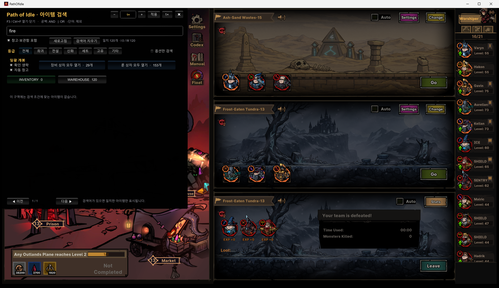
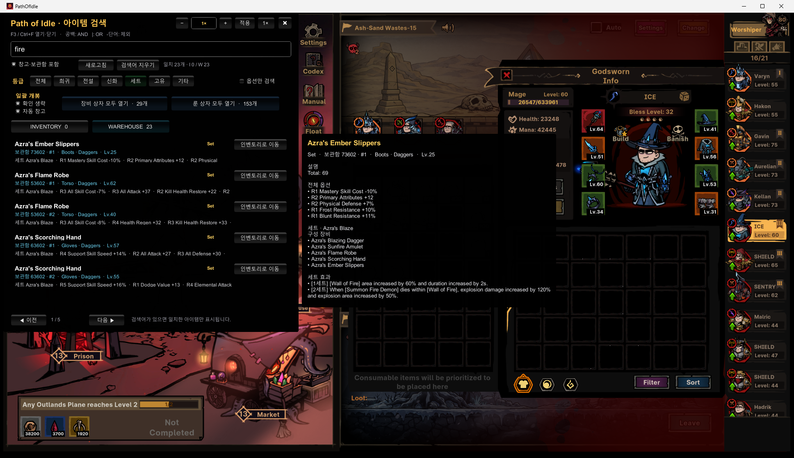
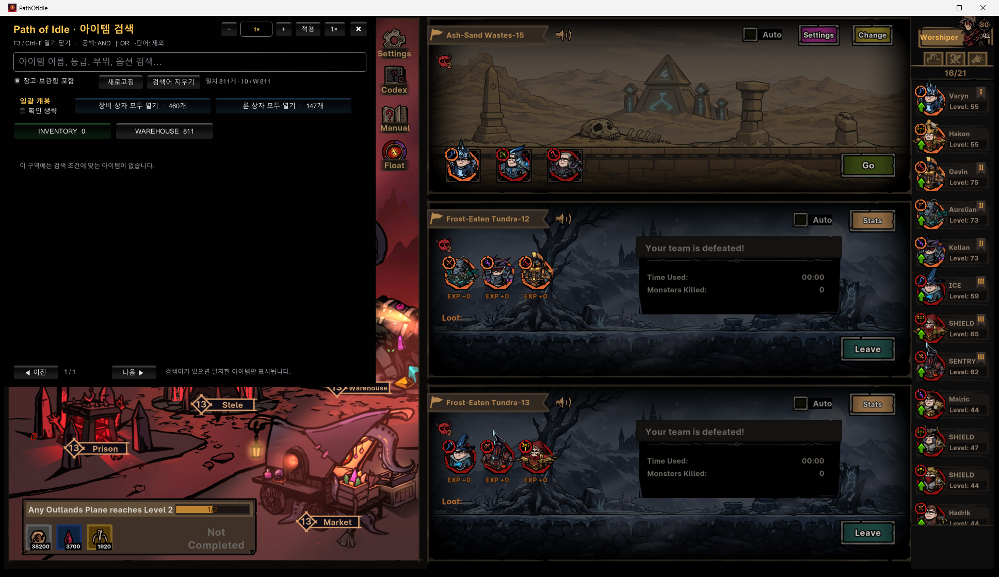

# Path of Idle In-Game Search

[English](README.md) · [한국어](README.ko.md) · [简体中文](README.zh-CN.md) · **繁體中文**

一款非官方 Windows 模組，可在 Path of Idle 遊戲內搜尋和管理背包、Warehouse 與 Vault 中的物品。它透過單一不透明覆蓋視窗提供搜尋、完整提示、遊戲原生物品移動、依品質批次開啟，以及 0.1×–100× 速度控制。

## 功能

- 使用 `F3` 或 `Ctrl+F` 開啟或關閉視窗
- 依名稱、品質、部位、等級、詞綴、套裝和存放位置搜尋
- 空格表示 `AND`，`|` 表示 OR，`-詞語` 表示排除，`"短語"` 表示完整短語
- 僅顯示相符物品並醒目標示相符文字
- 分別查看背包與 Warehouse/Vault 結果
- 多選 Rare、Legendary、Mythic、Set、Unique 和其他品質；再次點擊即可取消
- 僅搜尋詞綴和套裝效果
- 將滑鼠停在物品上，查看完整說明、全部詞綴、套裝部件及各階段套裝效果
- 直接從搜尋結果在背包與倉庫之間移動物品
- 使用遊戲本身的儲存邏輯，依解鎖狀態和品質規則移入 Warehouse 或 Vault
- 依品質多選批次開啟裝備箱和符文箱，並支援「以上」模式
- 可略過第二次確認、空間不足時僅開啟可容納數量，並自動存放新裝備
- 將目前裝備也納入候選，以交易方式精確裝備兩把武器與其他六個部位，共八個裝備欄位；逐欄驗證，失敗時回復。背包已滿且沒有可逆的中轉空位時會安全停止並還原原狀
- 裝備過程遵循遊戲原生 Warehouse/Vault 路由，並在成功後將物品整理到已解鎖的正確 Vault 群組
- 強制遵守職業與技能武器規則，並使用遊戲原生 Mythic 裝備數量限制
- 結合遊戲原生屬性、符文詞綴、已啟用套裝階段和技能協同，依所選基礎技能的原生傷害、冷卻與技能速度估算約 60 秒持續輸出；此分數並非精確的戰鬥 DPS 模擬
- 可在設定次數內使用 Shrine 的正常付費轉換尋找符合效能目標的技能；保留重置費用以及固定／Alien 技能，任何轉換、重置或分配驗證不完整時都不會回報成功
- 使用預設按鈕或直接輸入，將遊戲速度調整為 0.1×–100×
- 僅在模組視窗取得焦點時阻擋遊戲鍵盤；角色切換滾輪也只在滑鼠位於已聚焦視窗內時阻擋
- 保存視窗位置、搜尋詞、篩選、速度、語言及批次開啟設定
- 自動跟隨遊戲語言，或手動選擇韓文、英文、簡體中文和繁體中文

物品名稱與說明使用遊戲目前提供的本地化文字，英文物品名稱也會作為搜尋別名加入索引。

## 畫面截圖

### 搜尋、品質篩選與批次開啟

### 完整套裝物品說明與套裝效果

### 不透明遊戲內覆蓋視窗

## 安裝與更新

1. 從 [Releases](../../releases) 下載最新的 `PathOfIdleInGameSearch-*.zip`。
2. 完整解壓縮 ZIP。
3. 關閉 Path of Idle。
4. 雙擊 `install.bat`。
5. 啟動遊戲並按 `F3`。

安裝程式會自動尋找 Steam 遊戲目錄。若尚未安裝 BepInEx，它只會下載固定的官方 `6.0.0-be.760` IL2CPP x64 版本，並在安裝前驗證 SHA-256。若已安裝 BepInEx，則會繼續使用現有安裝，只安裝或更新本模組 DLL。

發行版 DLL 不包含本模組的診斷記錄或偵錯符號。全新安裝 BepInEx 時，主控台與磁碟記錄也預設關閉；已有 BepInEx 則保留原有記錄設定。

覆蓋舊版本重新安裝不會改寫 `BepInEx/config/local.pathofidle.ingame-search.cfg`，因此使用者設定會被保留。

## 操作

| 操作 | 按鍵或按鈕 |
| --- | --- |
| 開啟或關閉視窗 | `F3` 或 `Ctrl+F` |
| 關閉視窗 | `Esc` 或右上角 `×` |
| 變更介面語言 | 標題列中的 `AUTO·…`/語言按鈕 |
| 分級調整速度 | `−` 和 `+` |
| 輸入自訂速度 | 點擊速度欄，輸入 `0.1`–`100`，再按 Enter 或 `套用` |
| 恢復正常速度 | `1×` |
| 查看完整物品詳情 | 將滑鼠停在結果列上 |
| 切換結果頁 | 底部按鈕，或在結果區域使用滾輪 |

搜尋品質和開啟品質都支援多選。再次點擊已選品質即可取消；全部取消後會恢復為「全部」。開啟「以上」後，會從所選品質中最低的一個開始，包含所有更高品質。「其他」不參與品質排序，可獨立選擇。

`WAREHOUSE` 分頁包含一般 Warehouse 的所有頁面及已解鎖的 Vault 品質群組。存放裝備時，模組會呼叫遊戲原生的 `QuickMoveItemFromBagToStore`，而不會自行猜測目的地。

批次開啟預設需要點擊同一按鈕兩次。啟用「略過確認」後會立即執行，因此請先檢查所選品質、剩餘空間和「自動入庫」設定。模組每幀只開啟一個，並驗證遊戲是否確實扣除；若未扣除，會立即停止且不重試，以防部分獎勵重複。篩選針對你所持有箱子的品質，不會修改隨機獎勵的品質。

自動配裝會套用到遊戲中目前選擇的英雄，並同時搜尋八個裝備欄位。職業與技能武器規則是硬性限制。評分會讀取原生屬性、所有執行時詞綴、賦予技能、技能變體、符文與真實的 2 件／4 件套裝階段，不會因官方攻略中繼資料而額外加分。它使用遊戲原生傷害、冷卻、技能速度和所選主題估算約 60 秒輸出，但不會完整模擬敵方防禦、移動、複雜觸發、投射物行為、持續傷害疊層或召喚物 AI。裝備以可驗證交易方式在背包、Warehouse 和已解鎖 Vault 之間移動，遵守遊戲原生 Mythic 上限與儲存路由；失敗時回復。

自動技能會依所選效能主題評估同職業的原生 Shrine 候選，並使用包含里程碑的精確點數預算。它保留固定與 Alien 技能，遵守解鎖列和武器需求，只選擇預估貢獻為正的專精。可在設定次數內使用正常 Blood 付費轉換並保留重置費用；重置、已學技能、變體、點數與 Blood 消耗都採用失敗即停止驗證。60 秒結果只是有限預覽，並非完整戰鬥模擬。自動裝備與自動技能操作都需要第二次確認。

`100×` 等極高速度可能略過較短的動畫或計時器。完成操作後建議恢復為 `1×`。

## 解除安裝

關閉遊戲並執行 `uninstall.bat`。它只會移除本模組 DLL，不會刪除 BepInEx、其他模組或使用者設定檔。

## 從原始碼建置

需要 .NET 6 SDK 或更新版本。安裝 BepInEx 後執行一次遊戲以產生 interop 組件，關閉遊戲，再執行 `scripts\build.ps1`。建置過程只參照本機安裝的遊戲組件，儲存庫中不包含遊戲檔案。

## 相容性

- Windows x64
- Steam 版 Path of Idle
- Unity IL2CPP 與 BepInEx 6

若遊戲更新變更內部資料結構，模組可能需要同步更新。

本專案是非官方粉絲作品，與 Path of Idle 或 BepInEx 的開發者無關。使用非官方模組前，建議備份重要存檔。
